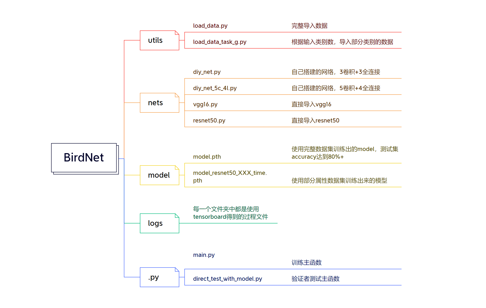

首先请您判断您的身份：1.验证者 2.研究者

如果您是**验证者**：
1. 安装依赖项  ```pip install -r dependency.txt```
2. 命令行运行 ```python direct_test_with_model.py```，随后程序会根据已经训练好的模型对于测试集中的数据进行测试，最后在命令行中输出结果。  
需要提及的是，在测试过程中命令行会反复弹出**警告**，这是正常现象。
3. 具体训练过程中的数据可以再./log中查看，可以移步到log中的Readme

如果您是**研究者**：
1. 安装依赖项  ```pip install -r dependency.txt```
2. 从链接下载数据集https://cloud.tsinghua.edu.cn/f/05af5451175a4b119405/，并且将train, test, valid文件夹放置到本目录下，如下图所示：

3. 命令行运行 ```python main.py```，随后可以开始训练。  
需要提及的是，本代码并没有采用argument，故而需要再main中的step1中修改基本参数，以及在step2中修改基本模块信息。
4. 整体的代码结构如下所示：
