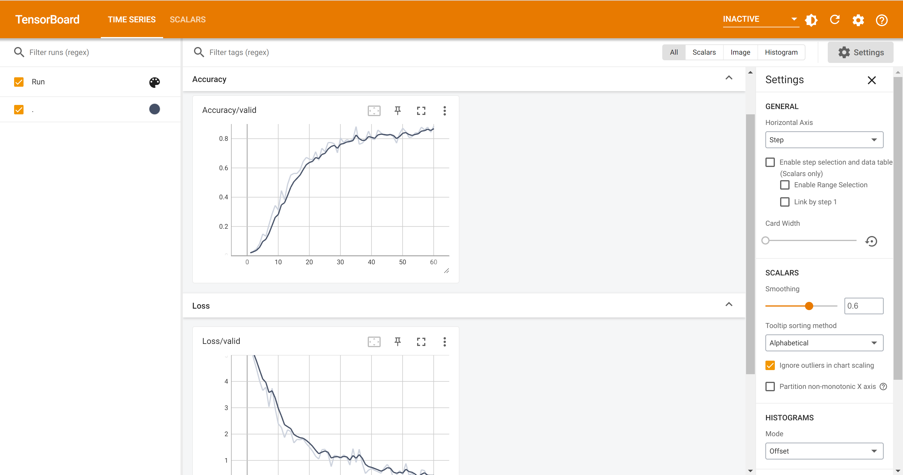

log中是使用tensorboard记录的实验过程数据。具体查看方法如下：  
比如您想查看文件夹 ./haha 里的具体实验数据：
1. 使用管理员身份打开命令行，并且进入到./log 目录下
2. 输入```tensorboard --logdir=haha --bind_all```，  
命令行中弹出```TensorBoard 2.XX.X at http://localhost:6006/```
3. 随后在浏览器中访问```http://localhost:6006/```，即可看到tensorboard界面，如下所示：
